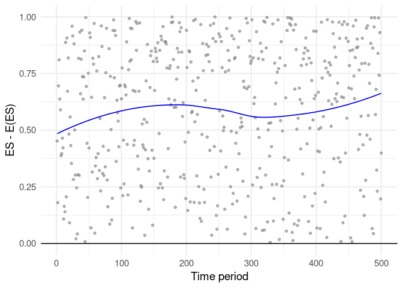

R package forecastcalibration
================

This package accompanies the paper \`Score-based calibration testing for
multivariate forecast distributions’ by Malte Knüppel, Fabian Krüger and
Marc-Oliver Pohle:

The package’s main functions are as follows:

-   `score_calibration_es` computes the quantities *Û*<sub>ES, *t*</sub>
    and *D̂*<sub>ES, *t*</sub> for the test versions based on the Energy
    Score
-   `knueppel_test` implements the uniformity test by Knüppel
    (JBES, 2015) that allows for time dependence under the H0
-   `t_hac` implements a HAC robust t-test

## Installation

To install the package from GitHub, please run:

``` r
# install.package(remotes)
remotes::install_github("FK83/forecastcalibration")
```

Note that the package contains C++ code, so that Windows users may need
to install the Rtools suite provided by CRAN.

## Example

This toy example simulates `n` IID time periods. The forecast
distribution is H0 considered in the simulation study of Section 4 in
the paper; the true distribution is given by H1. Note that
auto-calibration is violated here, so it is desirable for the tests to
reject with a small *p*-value.

``` r
library(mvtnorm)
library(forecastcalibration)

set.seed(1)

# Dimension of data (nr of variables)
d <- 4
# Sample size (nr of time periods)
n <- 500
# Nr of forecast draws (for each of n periods)
J <- 5e3

# forecast covariance matrix (corresponding to H0 in Section 4 of the paper)
sig_fc <- matrix(.5, d, d)
diag(sig_fc) <- 1

# true covariance matrix (H1 in Section 4)
sig_true <- sig_fc
diag(sig_true) <- (1.1)^2

# simulate outcomes for n time periods
y <- rmvnorm(n, sigma = sig_true)

# initialize vectors to store calibration stats for each period
u <- d <- rep(NA, n)

# loop over time
for (tt in 1:n){
  # Simulate forecast distribution for current period (J draws)
  x <- rmvnorm(J, sigma = sig_fc)
  # Compute U and D for energy score in current period
  es_tmp <- score_calibration_es(y[tt, ], t(x), exact = FALSE)
  u[tt] <- es_tmp$u
  d[tt] <- es_tmp$d
}

# Run calibration tests
knueppel_test(u) # PIT-based test (Generalized Box Transform)
```

    ## $stat
    ##          [,1]
    ## [1,] 51.85725
    ## 
    ## $pval
    ##              [,1]
    ## [1,] 1.477595e-10
    ## 
    ## $nlags_odd
    ## [1] 3
    ## 
    ## $nlags_even
    ## [1] 3
    ## 
    ## $moments
    ## [1] "1234"

``` r
t_hac(d) # Entropy test 
```

    ## $t
    ##          [,1]
    ## [1,] 7.031735
    ## 
    ## $k
    ## [1] 2
    ## 
    ## $pval
    ##              [,1]
    ## [1,] 2.039811e-12

## Calibration plot

Here we visualize the entropy test results for the simulated data. The
plot is in the same style as Figures X, Y and Z in the paper.

``` r
# load ggplot2 package
library(ggplot2)

# make plot
ggplot(data.frame(t = 1:n, u = u), aes(x = t, y = u)) + 
  xlab("Time period") + ylab("ES - E(ES)") + 
  geom_point(pch = 20, col = grey(.5, .6), size = I(2)) + 
  theme_minimal(base_size = 14) + 
  geom_hline(yintercept = 0) + 
  geom_smooth(se = FALSE, color = "blue2", size = I(.6)) 
```

    ## `geom_smooth()` using method = 'loess' and formula 'y ~ x'

<!-- -->
